## Cove

| Preview Image | Description |
|--------------|-------------|
| 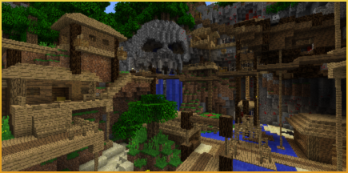 | Try to survive in this pirate's hidden camp, full of shipwrecks and caves! |

| Size | UpdatePlayer Position |
|------|----------------------|
| Small | `219, 73, -220` |
| Large | `45, 76, 251` |
| Huge | `45, 76, 251` |

## Cavern

| Preview Image | Description |
|--------------|-------------|
| 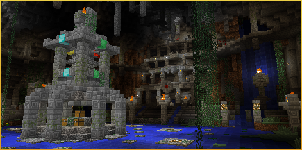 | This ancient looking underground structure is the perfect place to sneak up on your enemies! |

| Size | UpdatePlayer Position |
|------|----------------------|
| Small | `-222, 84, 286` |
| Large | `268, 47, 12` |
| Huge | `268, 47, 12` |

## Crucible

| Preview Image | Description |
|--------------|-------------|
|  | A world built deep in the Nether, with plenty of lava for your enemies to swim in! |

| Size | UpdatePlayer Position |
|------|----------------------|
| Small | `317, 78, 301` |
| Large | `348, 38, 331` |
| Huge | `348, 38, 331` |

## Lair

| Preview Image | Description |
|--------------|-------------|
| 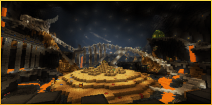 | Battle in the dragon's lair. |

| Size | UpdatePlayer Position |
|------|----------------------|
| Small | `45, 32, 45` |
| Large | `70, 51, 70` |
| Huge | `70, 51, 70` |

## Medusa

| Preview Image | Description |
|--------------|-------------|
| 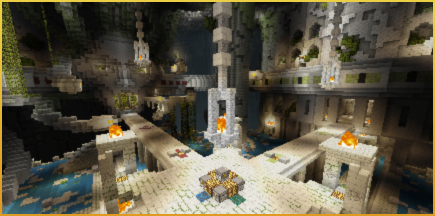 | Don't look directly at her! |

| Size | UpdatePlayer Position |
|------|----------------------|
| Small | `228, 67, 100` |
| Large | `239, 69, 100` |
| Huge | `239, 69, 100` |

## Temple

| Preview Image | Description |
|--------------|-------------|
|  | This mysterious temple is set within the deepest jungle. Watch out for enemies lurking in the tree tops! |

| Size | UpdatePlayer Position |
|------|----------------------|
| Small | `-34, 59, -255` |
| Large | `-118, 20, -148` |
| Huge | `-118, 20, -148` |

## Atlantis

| Preview Image | Description |
|--------------|-------------|
| 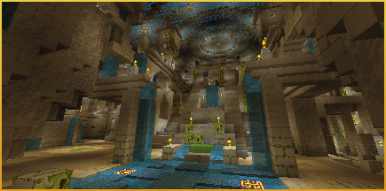 | Deep beneath the ocean, a lost city lay in ruins. Atlantis awaits the battle. |

| Size | UpdatePlayer Position |
|------|----------------------|
| Small | `152, 41, 154` |
| Large | `149, 56, 175` |
| Huge | `149, 56, 175` |

## Siege

| Preview Image | Description |
|--------------|-------------|
| 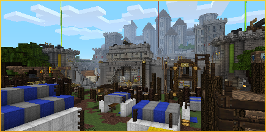 | Brave the enemy walls or defend the keep. The siege is upon us. |

| Size | UpdatePlayer Position |
|------|----------------------|
| Small | `52, 72, 197` |
| Large | `52, 72, 208` |
| Huge | `52, 72, 208` |

## Ruin

| Preview Image | Description |
|--------------|-------------|
| 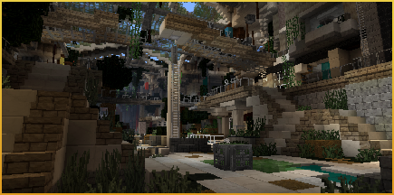 | Abandoned and left to ruin, there are still secrets left to be found. Battle for the remaining resources and survive this hazardous place. |

| Size | UpdatePlayer Position |
|------|----------------------|
| Small | `-206, 20, 178` |
| Large | `-51, 9, 50` |
| Huge | `-51, 9, 50` |

## Castle

| Preview Image | Description |
|--------------|-------------|
| 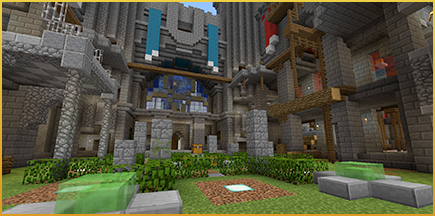 | Crown yourself in glory in the Castle's great halls. |

| Size | UpdatePlayer Position |
|------|----------------------|
| Small | `40, 68, 40` |
| Large | `-169, 72, 134` |
| Huge | `-169, 72, 134` |

## Shipyard

| Preview Image | Description |
|--------------|-------------|
|  | A port in the sky away from the storm, but this arena is anything but calm. |

| Size | UpdatePlayer Position |
|------|----------------------|
| Small | `-9, 164, -1` |
| Large | `20, 164, -18` |
| Huge | `20, 164, -18` |

## Invasion!

| Preview Image | Description |
|--------------|-------------|
| 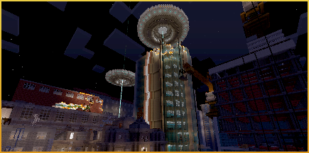 | An alien attack has created a dangerous arena. Defend your rooftops but don't fall off! |

| Size | UpdatePlayer Position |
|------|----------------------|
| Small | `-70, 47, 80` |
| Large | `313, 45, -229` |
| Huge | `313, 45, -229` |

## Frontier

| Preview Image | Description |
|--------------|-------------|
| 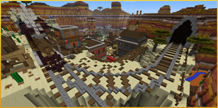 | It's high noon! Things are about to get wild in the Old West, so grab a fistful of TNT, slap on a sou'wester and prepare for an almighty dustbowl dust-up between the good, the bad and the ugly. |

| Size | UpdatePlayer Position |
|------|----------------------|
| Small | `288, 74, 211` |
| Large | `288, 74, 211` |
| Huge | `288, 74, 211` |

## Dig

| Preview Image | Description |
|--------------|-------------|
| 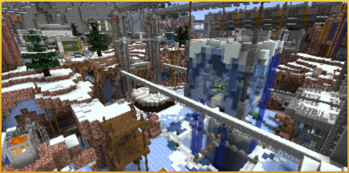 | A snowbound excavation site lies deserted. What unspeakable things did the scientists discover beneath the ice? Find out for yourself, while battling against both the elements and each other! |

| Size | UpdatePlayer Position |
|------|----------------------|
| Small | `59, 61, 136` |
| Large | `59, 61, 136` |
| Huge | `59, 61, 136` |

## Shrunk

| Preview Image | Description |
|--------------|-------------|
| 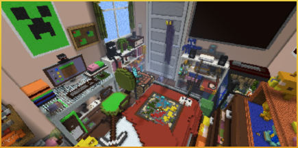 | Are you tiny or is everything else just really, really big? Be careful not to lose your sense of proportion as you fight your way across this over-sized bedroom and tidy up the competition. |

| Size | UpdatePlayer Position |
|------|----------------------|
| Small | `-82, 40, 134` |
| Large | `47, 36, 127` |
| Huge | `47, 36, 127` |

## Valley

| Preview Image | Description |
|--------------|-------------|
|  | Discover your inner self as you battle across this ancient land of dragons! This Battle map is exclusive to the Chinese Mythology Mash Up. |

| Size | UpdatePlayer Position |
|------|----------------------|
| Small | `213, 91, 239` |
| Large | `213, 91, 239` |
| Huge | `213, 91, 239` |

## Capitol

| Preview Image | Description |
|--------------|-------------|
|  | Clamber through the ruins of the Capitol! Who will rise from the rubble to battle their way through the wasteland? |

| Size | UpdatePlayer Position |
|------|----------------------|
| Small | `155, 56, 153` |
| Large | `-2, 64, -9` |
| Huge | `-2, 64, -9` |

## Libertalia

| Preview Image | Description |
|--------------|-------------|
| 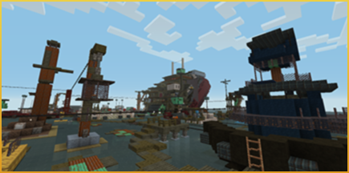 | Battle through the troubled waters of Libertalia! Who will captain the seas in this watery graveyard of ships? |

| Size | UpdatePlayer Position |
|------|----------------------|
| Small | `158, 29, 180` |
| Large | `-12, 28, 197` |
| Huge | `-12, 28, 197` |

## Atomics

| Preview Image | Description |
|--------------|-------------|
| 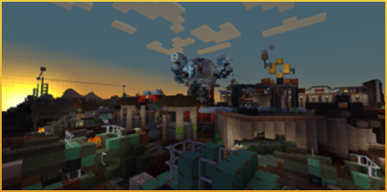 | Face the perils of the General Atomics Galleria! Is Mister Handy friend or foe? Will you dodge the traps rigged to blow?  |

| Size | UpdatePlayer Position |
|------|----------------------|
| Small | `144, 41, 222` |
| Large | `144, 41, 222` |
| Huge | `144, 41, 222` |

## Festive

| Preview Image | Description |
|--------------|-------------|
| 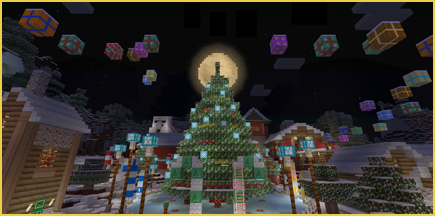 | Get together with friends and family for some Minecraft-style tussling in this special seasonal battle map. The more the merrier! Guaranteed to be more fun than pretending you like the socks your uncle gave you. |

| Size | UpdatePlayer Position |
|------|----------------------|
| Small | `17, 58, 9` |
| Large | `17, 58, 9` |
| Huge | `17, 58, 9` |

## Halloween

| Preview Image | Description |
|--------------|-------------|
| 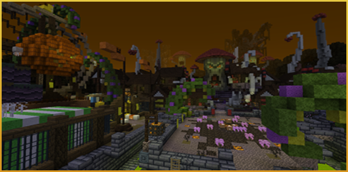 | Something wicked this way comes. Full of deadly thrills and sinister shocks, it will scare you off your Minecraft blocks! |

| Size | UpdatePlayer Position |
|------|----------------------|
| Small | `56, 33, 141` |
| Large | `56, 45, 141` |
| Huge | `56, 45, 141` |