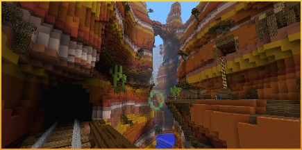
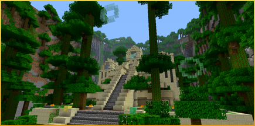
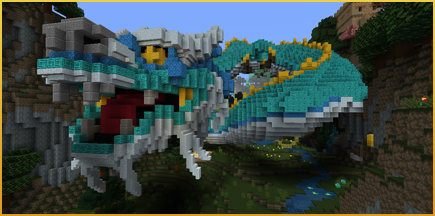
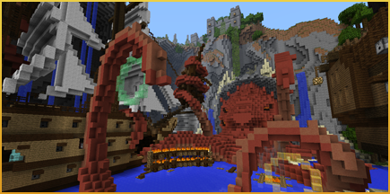
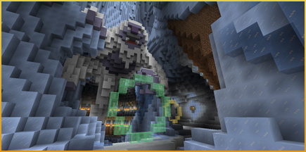
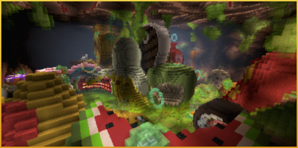
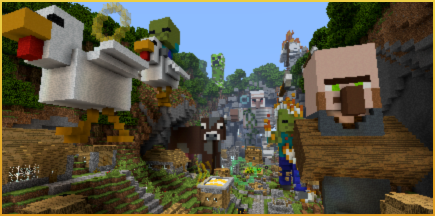
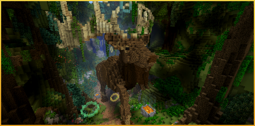
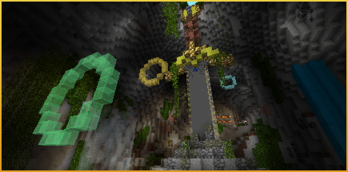
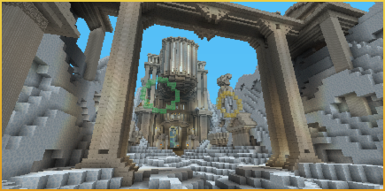

# Glide Maps

## Map Pack 0
### Canyon

Soar through the Canyon's windswept strata, winding round stone arches and frontier railways, on this Wild West express to reach ancestral lands.

### Cavern

Fly through the ancient catacombs of the Cavern!

### Temple

Dive deep into the jungle and discover the secrets of the Temple.

## Glide Beasts Track Pack
### Dragon

Share the skies with Dragons, soaring above the epic landscape of this Chinese Mythology-inspired track.

### Kraken

Plunge past the pirates' wrecks to find forgotten treasures. But beware: the Kraken awaits!

### Yeti

Swoop down the icy glacier and between the bones of giants to discover the lost land of the Yeti.

## Glide Giants Track Pack
### Body

A junk food junkyard! A vessel of viruses! A flotilla of phlegm! Grit your teeth for a slimy flight on this unhealthy trip through the human body.

### Mobs

Swoop over, around and beneath the mighty, monolithic mobs that dominate the skyline of this out-of-scale track.

### Shrunk

Are you tiny or is everything else just really, really big? Be careful not to lose your sense of proportion as you glide your way through this oversized house and tidy up the competition.

## Glide Myths Track Pack
### Celts

Slalom through Standing Stones and marvel at mighty beasts, as you traverse a track inspired by Europe's mystic past.

### Excalibur

Castles and dragons tower over this fantasy Glide track. It'll take flying skills of some (ex)caliber to get you to the end of this Arthurian legend.

### Icarus

Swoop down the slopes of Mount Olympus, twist through the labyrinth's many turns and hurtle into Hades. Remember to pay the ferryman for safe passage!
